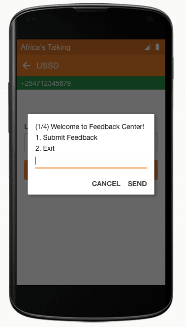
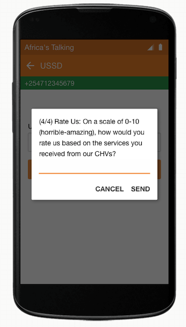

# BFS Project
Development of a Beneficiary Feedback System (BFS) for collecting feedback from care recipients who receive services from Community Health Workers in low-resource settings.

 

# Publication
Fabian Okeke, Lucas Nene, Anne Muthee, Stephen Odindo, Dianna Kane, Isaac Holeman, and Nicola Dell.
[Challenges and Opportunities in Connecting Care Recipients to the Community Health Feedback Loop](http://nixdell.com/papers/2018-ictd-bfs.pdf).
International Conference on Information and Communication Technologies and Development (ICTD 2019).
[pdf](http://nixdell.com/papers/2018-ictd-bfs.pdf).

# Libraries
[ussd_airflow](https://github.com/mwaaas/ussd_airflow)

# Test in Simulator
- Launch Africa's Talking Simulator [example](https://simulator.africastalking.com:1517/simulator/ussd)
- Enter Country / Phone (e.g. Kenya / +254-7-123-456-789)
- Enter ussd code `*384*11100#` and then call button
- USSD screen sessions will appear
- Congrats!

# Active USSD Codes
- `*384*11100#`
- `*384*99900#`

# Create Screen Content
- Modify [screens.yml file in this repo](https://github.com/fnokeke/BFS/blob/master/UssdApp/static/screens.yml)
- [Check here](https://django-ussd-airflow.readthedocs.io/en/latest/tutorial.html) for more information on creating ussd screens

# Capture Error in User Input
To capture error in a given screen:
- `validators` block is required in your screens.yml
- Update `LIST_OF_ERROR_PHRASES` in `error_terms.py` to include matching phrases (**case_sensitive**).
This phrase is used as a workaround to discover errors in ussd_airflow library.
- Example:
    ```
    <!--screens.yml -->
    ...
    step3_enter_age:
    type: input_screen
    text: "(3/4) Your age\n"
    input_identifier: age
    next_screen: step4_enter_nps
    validators:
        - regex: ^(1[89]|[2-9][0-9])$
          text:
            en: |
              Re-enter age (between 18 and 99) # Re-enter is our trigger phrase
            sw: |
              Re-enter age (kutoka 18 hadi 99)
    ...

    <!--error_terms.py -->
    LIST_OF_ERROR_PHRASES = [
        "Re-enter"          # Re-enter matches with trigger phrase (case sensitive)
    ]
m
    ```

# Database
- Install Postgres on your machine, login and create a database for your project:
    - Installation: (mac: `brew install postgres`; Ubuntu: `sudo apt-get install postgresql postgresql-contrib`)
    - Login into shell using postgres admin user (mac: `psql -U postgres`; Ubuntu: `sudo su - postgres`)
    - Create your database (`CREATE DATABASE your_db_name;`) *NB: semi-colon is required.*
    - Create user and strong password (`CREATE USER your_user WITH PASSWORD 'your_password';)
    - Update settings of user role:
        ```
        ALTER ROLE your_user SET client_encoding TO 'utf8';
        ALTER ROLE your_user SET default_transaction_isolation TO 'read committed';
        ALTER ROLE your_user SET timezone TO 'UTC';
        ```
    - Grant user rights: `GRANT ALL PRIVILEGES ON DATABASE your_db_name TO your_user;`
- Install psycopg2 in your [virtualenv](https://virtualenv.pypa.io/en/latest/) using `pip install django psycopg2`
- Update `DATABASES` variable in your Django project `settings.py`:
    ```
    'ENGINE': 'django.db.backends.postgresql_psycopg2',
    'NAME': secret.DB_NAME,         # your_db_name (kept ours in a separate file not in this repo)
    'USER': secret.DB_USER,         # your_user
    'PASSWORD': secret.DB_PASSWORD, # your_password
    'HOST': 'localhost',            # your_host
    'PORT': ''                      # '' means default port
    ```
- Make migrations:
    ```
    python manage.py makemigrations
    python manage.py migrate
    ```
- Create Django admin account: `python manage.py createsuperuser` (enter username, email, password)
- Visit [http://localhost:8000/admin] to login into admin mode
- You can add models (tables) to `models.py` and then run migration command above to create them in your DB

- If your migrations result in undetected changes or they are not creating tables in your tables. Try:
   ```
    python manage.py migrate --fake APPNAME zero
    python manage.py migrate APPNAME
   ```
